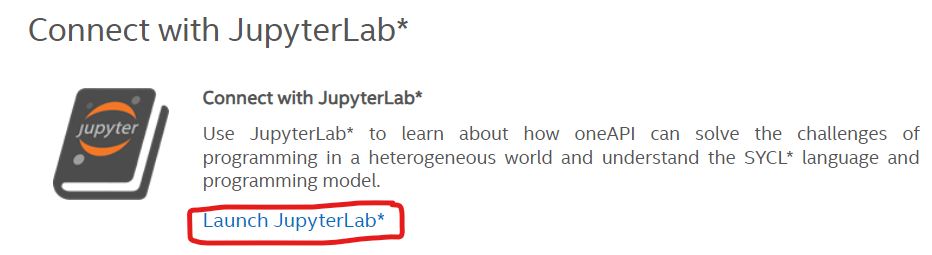
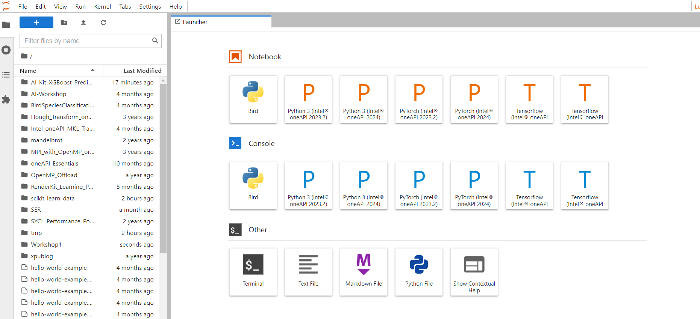
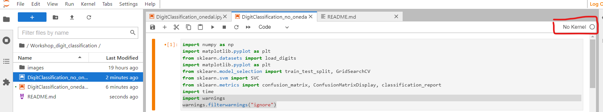
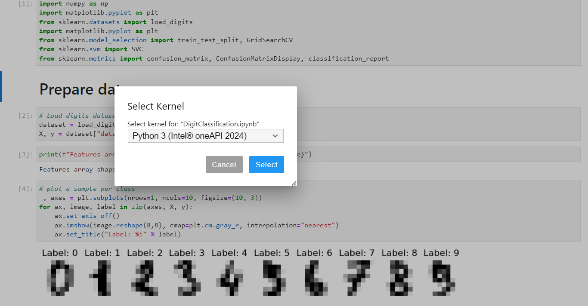

# Intel OneAPI Student Embassador Workshop: Digit Classification

The purpose of this demo is to see the impact of oneDAL on accelerating the training time.\
Follow these instructions:

1. Register with the Intel Devcloud at
   https://devcloud.intel.com/oneapi/get_started/

2. Click on Get Free Access

3. Scroll down to the page bottom and click "Launch Jupyterlab" 
 

4. Now you will have a similar view: 
 

5. Open a terminal and clone the repository by running this command: git clone https://github.com/Sinda271/Workshop_digit_classification.git

6. Navigate to the working directory Workshop_digit_classification in the side bar

7. Open DigitClassification_no_onedal.ipynb

8. Select the kernel:
 
 

9. Execute cells

10. Repeat the steps 8 and 9 for DigitClassification_onedal.ipynb

